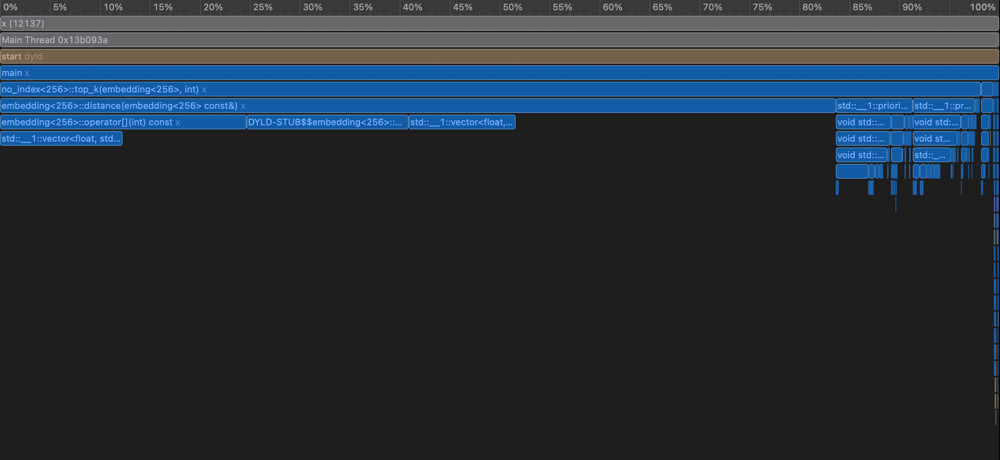
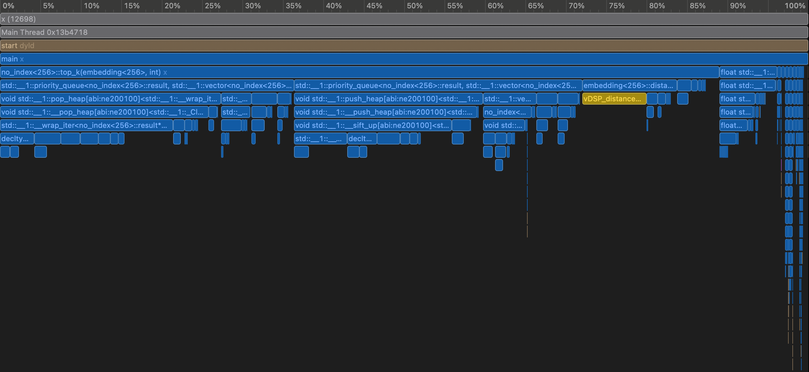
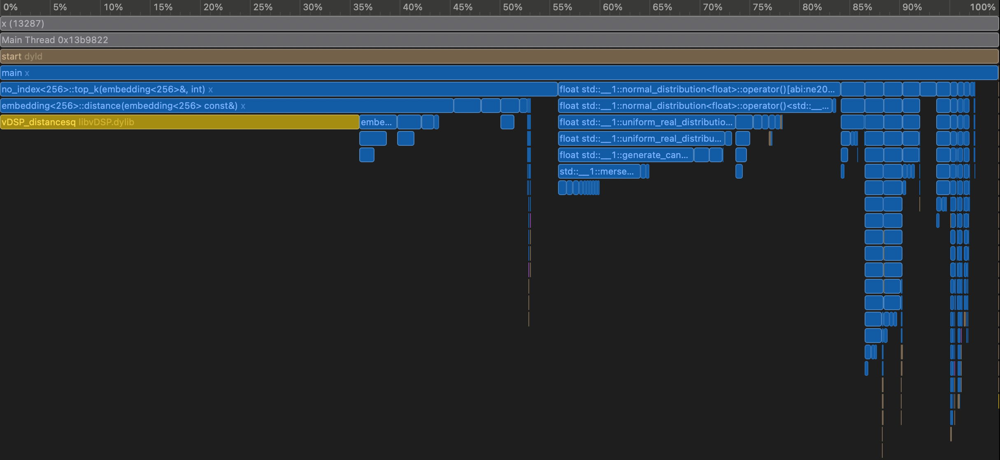

# Vector Similarity Search

Author: jay@thoughtmachina.com

Vector similarity search has become a foundational building block for modern AI systems. From semantic search and recommendation engines to image retrieval, anomaly detection, and retrieval-augmented generation (RAG), many applications rely on the ability to quickly find items that are *close* to a query vector in high-dimensional space. These vectors typically come from machine-learned embeddings, where geometric proximity captures semantic or behavioral similarity. The challenge is that as datasets grow to millions or billions of vectors, naively comparing a query against every stored vector becomes computationally impractical.

At a high level, vector search systems trade exactness for efficiency using specialized **indexes**. Some approaches focus on speeding up raw distance computation, others reduce the search space by clustering or compressing vectors, and graph-based methods navigate the vector space by following neighborhood relationships. More recent designs extend these ideas to disk-resident data, enabling low-latency search at massive scale. Understanding these techniques and the design trade-offs behind them is key to building fast, scalable, and cost-effective similarity search systems.

**Meet the `timer`**

```cpp
class timer {
private:
    std::chrono::high_resolution_clock::time_point start_time;
    uint64_t micro_sec_elapsed = 0;

public:
    timer() { start_time = std::chrono::high_resolution_clock::now(); }
    void start() { start_time = std::chrono::high_resolution_clock::now(); }

    uint64_t elapsed() {
        auto end_time = std::chrono::high_resolution_clock::now();
        auto duration =
            duration_cast<std::chrono::microseconds>(end_time - start_time);
        micro_sec_elapsed = duration.count();
        return micro_sec_elapsed;
    }

    uint64_t get_elapsed() { return micro_sec_elapsed; }
};
```

Meet the `timer` class — a tiny but opinionated helper whose sole job is to keep us honest about performance. It doesn't optimize anything, parallelize nothing, and accelerate exactly zero instructions. What it *does* do is tell us, in microseconds, how long our brilliant ideas actually take to run.

In vector similarity search, performance isn’t a “nice to have.” It’s the difference between a system that feels instant and one that quietly melts CPUs in the background. As we experiment with different algorithms and data structures, this class will act as our stopwatch of truth. If an approach is theoretically elegant but practically slow, the timer will call it out without mercy. Numbers don’t lie especially when they’re measured in microseconds.

**The `embedding`**

```cpp
template <int size> class embedding {
public:
    embedding() : m_vector(size) {}

    embedding(const std::vector<float>& vector) : m_vector(vector) {
        if (m_vector.size() != size) {
            throw std::runtime_error("Invalid embedding size");
        }
    }

    float distance(const embedding<size>& other) {
        float dist = 0.0f;
        for (int i = 0; i < size; i++) {
            float d = other[i] - m_vector[i];
            dist += d * d;
        }
        return dist;
    }

    float operator[](int index) const { return m_vector[index]; }
    float& operator[](int index) { return m_vector[index]; }

    const std::vector<float>& data() const { return m_vector; }

private:
    std::vector<float> m_vector;
};
```

The `embedding` class is just a thin wrapper around a vector of floats. It represents a fixed-size embedding and gives us a way to compute distance between two embeddings.

# Brute force

Before we get clever, it’s worth starting with the most straightforward approach possible. This gives us a clean mental model and a performance baseline we can’t argue with.

```cpp
template <int size> class no_index {

public:
    struct result {
        int index;
        float distance;
    };
    void add(embedding<size> vector) { m_data.push_back(vector); }

    std::vector<result> top_k(embedding<size> vector, int k) {
        std::priority_queue<result, std::vector<result>, _result_compare>
            top_closest;

        for (int i = 0; i < m_data.size(); i++) {
            result distance{i, vector.distance(m_data[i])};

            top_closest.push(distance);
            if (top_closest.size() > k) {
                top_closest.pop();
            }
        }

        std::vector<result> res;
        res.reserve(top_closest.size());

        while (!top_closest.empty()) {
            res.push_back(top_closest.top());
            top_closest.pop();
        }

        std::reverse(res.begin(), res.end());
        return res;
    }

private:
    struct _result_compare {
        bool operator()(const result& l, const result& r) {
            return l.distance < r.distance;
        }
    };
    std::vector<embedding<size>> m_data;
};
```

This is the **baseline**: no index, no shortcuts, no mercy. The `no_index` class does exactly what you’d expect — it stores every embedding and, at query time, computes the distance to *all of them*. `top_k` walks through the entire dataset, measures distance one vector at a time, and keeps only the best `k` results using a priority queue. It’s simple, correct, and painfully honest about the cost of similarity search. This brute-force approach gives us a ground truth for both accuracy and performance. Everything we build later will be compared against this — and judged accordingly.

Before we start timing searches, we need data that actually resembles what vector indexes are built for. Pure randomness is useful for stress tests, but real embeddings usually have structure—clusters, neighborhoods, and local density. The following setup creates that structure by generating high-dimensional Gaussian clusters and sampling both the dataset and query vectors from them.

```cpp
int main() {
    const int width = 256;
    const int data_points = 160000;
    const int search_count = 1000;

    std::vector<embedding<width>> vectors;
    std::vector<embedding<width>> search_vectors;

    {
        // ------------------------------------------------------------
        // Create dataset: K Gaussian clusters in 256-D
        // ------------------------------------------------------------
        std::random_device rd;
        std::mt19937 gen(rd());

        const int true_k = 20; // real underlying clusters
        std::normal_distribution<float> center_noise(0.0f, 1.0f);
        std::normal_distribution<float> point_noise(0.0f, 0.10f);

        // Generate true cluster centers
        std::vector<std::vector<float>> centers;
        centers.reserve(true_k);

        for (int c = 0; c < true_k; c++) {
            std::vector<float> ctr(width);
            for (int d = 0; d < width; d++) {
                ctr[d] = center_noise(gen) * 3.0f;
            }
            centers.push_back(std::move(ctr));
        }

        // Generate data points by sampling around these centers
        std::uniform_int_distribution<int> pick_cluster(0, true_k - 1);

        for (int i = 0; i < data_points; i++) {
            int cid = pick_cluster(gen);
            const auto& ctr = centers[cid];

            std::vector<float> vec(width);
            for (int d = 0; d < width; d++) {
                vec[d] = ctr[d] + point_noise(gen);
            }

            vectors.emplace_back(vec);
        }

        // ------------------------------------------------------------
        // Generate search vectors: sampled from real clusters
        // ------------------------------------------------------------
        for (int i = 0; i < search_count; i++) {
            int cid = pick_cluster(gen);
            const auto& ctr = centers[cid];

            std::vector<float> vec(width);
            for (int d = 0; d < width; d++) {
                vec[d] = ctr[d] + point_noise(gen);
            }

            search_vectors.emplace_back(vec);
        }
    }

    std::cout << "Starting to build an index:\n";
    timer timer;

    timer.start();
    no_index<width> wild_world;
    for (const auto& vec : vectors) {
        wild_world.add(vec);
    }
    uint64_t elapsed = timer.elapsed();
    std::cout << "Index built in " << elapsed << " micro secs\n";

    timer.start();
    for (int i = 0; i < search_vectors.size(); i++) {
        auto results = wild_world.top_k(search_vectors[i], 10);
    }
    elapsed = timer.elapsed();
    std::cout << "Search in " << elapsed << " micro secs\n";

    return 0;
}
```

With this in place, we have a complete and repeatable benchmark: structured data, realistic queries, and a brutally honest baseline. From here on, every optimization and indexing strategy will be measured against this setup—same data, same queries, same timer. If performance improves, we will know it earned it.

And now for the moment of truth — we run it.

```
jay@jayport:~/code/vector $ ./x
Starting to build an index:
Index built in 196048 micro secs
Search in 160132036 micro secs
```

Building the “index” (which is really just pushing vectors into a list) takes a fraction of a second. Searching, on the other hand, takes **~160 million microseconds** — **160 seconds** — to answer just 1000 queries. This is the reality of brute-force vector search in high dimensions: every query touches every vector, and the cost compounds fast. The code is correct. The results are accurate. The performance is… educational.

Let’s get the flamegraph and see if we can make a few optimizations quickly!



As is evidently clear, the `distance` function is the heaviest. Perhaps, SIMD? With the flamegraph pointing straight at `distance`, we make the most obvious move: **vectorize it**. The math itself doesn’t change — we’re still computing squared Euclidean distance — but we let the hardware do what it’s good at. Here, we swap the manual loop for SIMD-backed routines using `vDSP`. The result is fewer instructions, better cache behavior, and far more work done per CPU cycle. Same algorithm, same answers — just a lot less wasted time.

```cpp
template <int size> class embedding {
public:
    embedding() : m_vector(size) {}

    embedding(const std::vector<float>& vector) : m_vector(vector) {
        if (m_vector.size() != size) {
            throw std::runtime_error("Invalid embedding size");
        }
    }

    embedding& operator+=(const embedding& other) {
        vDSP_vadd(m_vector.data(), 1, other.raw(), 1, m_vector.data(), 1, size);
        return *this;
    }

    float distance(const embedding<size>& other) {
        float dist = 0.0f;
        vDSP_distancesq(other.raw(), 1, m_vector.data(), 1, &dist, size);
        return dist;
    }

    const float* raw() const { return m_vector.data(); }

    float operator[](int index) const { return m_vector[index]; }
    float& operator[](int index) { return m_vector[index]; }

    const std::vector<float>& data() const { return m_vector; }

private:
    std::vector<float> m_vector;
};
```

And just like that, the numbers tell the story:

```
jay@jayport:~/code/vector $ ./x
Starting to build an index:
Index built in 180855 micro secs
Search in 24136877 micro secs
```

Search time drops from **~160 seconds** to **~24 seconds**. No new data structures. No indexing. No approximation. Just letting the CPU stretch its SIMD legs.

This is an important lesson in vector search: before reaching for complex indexes, make sure the inner loop isn’t fighting the hardware. SIMD doesn’t change the algorithmic complexity — it just removes unnecessary suffering. And while 24 seconds is still far from fast, we’ve bought ourselves more than a **6× speedup** with a very small change.

Let’s get another flamegraph.



We now see that pushes and pops are now where most time is spent. Perhaps, we can go with a slighly different strategy — push only when we should.

```cpp
    std::vector<result> top_k(embedding<size>& vector, int k) {
        std::priority_queue<result, std::vector<result>, _result_compare>
            top_closest;

        float worst_distance = std::numeric_limits<float>::max();

        for (int i = 0; i < m_data.size(); i++) {
            float dist = vector.distance(m_data[i]);

            if (top_closest.size() < k) {
                top_closest.push({i, dist});

                if (top_closest.size() == k) {
                    worst_distance = top_closest.top().distance;
                }
            } else if (dist < worst_distance) {
                top_closest.pop();
                top_closest.push({i, dist});

                worst_distance = top_closest.top().distance;
            }
        }

        std::vector<result> res;
        res.reserve(top_closest.size());

        while (!top_closest.empty()) {
            res.push_back(top_closest.top());
            top_closest.pop();
        }

        std::reverse(res.begin(), res.end());
        return res;
    }
```

This keeps the inner loop tight:

- No unnecessary pushes
- No unnecessary pops
- No repeated `.top()` calls unless the heap actually changes

Same correctness, fewer instructions — exactly the kind of optimization that shows up immediately in the flamegraph.

And there it is — the kind of result that makes profiling worth the effort:

```
jay@jayport:~/code/vector $ ./x
Starting to build an index:
Index built in 185973 micro secs
Search in 3877655 micro secs
```

Search time drops to **~3.9 seconds**.



From **160 seconds → 24 seconds → under 4 seconds**, all without changing the algorithm or introducing an index. We just stopped wasting work:

- SIMD removed the pain from distance computation
- Smarter heap usage eliminated unnecessary pushes and pops
- Caching the worst distance kept the hot loop tight

This is a great reminder that brute force doesn’t have to be *stupid* brute force. But even at ~4 seconds, we’re still scanning every vector. 

**The next step is obvious: stop looking everywhere.**