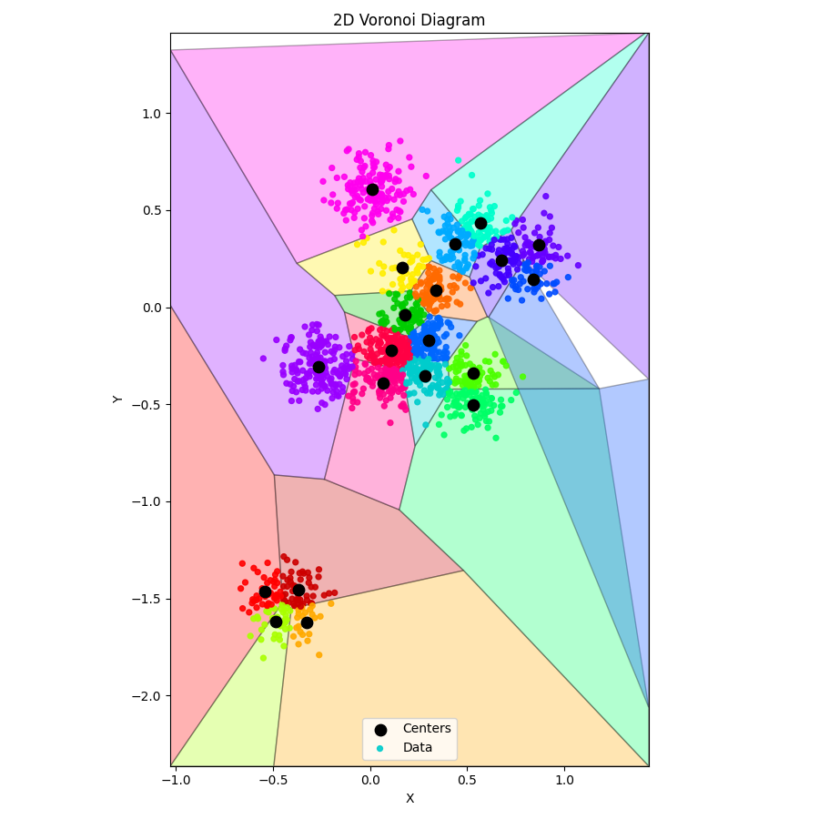

# Vector Similarity Search - Clustering

Author: jay@thoughtmachina.com

Brute force had its moment. We optimized it, vectorized it, and shaved cycles off every hot loop we could find. And after all that effort, the core behavior never changed: every single query still marched past every single vector. The math got faster, but the workload stayed exactly the same. That’s the real limit we’ve hit. Not instruction throughput. Not cache behavior. Strategy.

At some point, speedups from faster math flatten out because the algorithm insists on doing too much work. If we want another order-of-magnitude improvement, we don’t need better distance calculations — we need fewer of them. We need to stop looking everywhere.

The obvious way to do that is to reduce the search space before queries ever arrive. That means preprocessing. It’s not free. It burns CPU, it takes time, and it complicates ingestion. But ingest happens once; queries happen constantly. If you’re serious about query latency, paying upfront is the only trade that makes sense. What preprocessing buys us is structure. Without structure, every query has no choice but to rediscover the shape of the data from scratch. With structure, we can make informed decisions about where a query is likely to find good answers — and just as importantly, where it almost certainly won’t.

The simplest form of structure we can add is clustering.



Clustering takes a large, flat collection of vectors and breaks it into regions of similarity. Vectors that are close to each other in space get grouped together, and each group is summarized by a representative point, usually called a centroid. That centroid becomes a cheap proxy for everything inside the cluster.

At query time, this changes the game. Instead of comparing a query against every vector, we first compare it against the centroids. That tells us which regions of the space are worth paying attention to. Only those regions get searched in detail. The rest of the dataset is skipped entirely, without ever computing a single distance. This works especially well for embeddings because they are not random points. They’re trained so that semantic similarity turns into geometric proximity. Related things naturally bunch together. Queries drawn from the same underlying distribution tend to land near the same neighborhoods. Clustering doesn’t force structure onto the data — it exposes structure that’s already there and makes it usable at query time.

The most common way to do this is **k-means clustering**. It’s a blunt tool, but a reliable one. You pick a number of clusters, assign vectors to their nearest centers, recompute those centers, and repeat until things settle down. What you get at the end is a partitioned vector space with centroids that roughly describe where the data lives. At this stage, we’re still not doing anything fancy. There’s no compression, no graph traversal, no clever pruning logic. We’re just introducing one critical idea: learning where not to look. Once you stop treating the entire dataset as equally relevant to every query, similarity search starts to scale in ways brute force never can.

# **Meet `k_means`**

Clustering gives your vectors structure. Instead of touching every vector at query time, you first check centroids, pick promising clusters, and then only dive in where it matters. Here’s the full class:

```cpp
template <int size> class k_means {
public:
    explicit k_means(int k) : m_k(k) {}

    void add(embedding<size> vector) { m_list.push_back(std::move(vector)); }

    void print_centers() {
        std::cout << "CENTERS[" << m_k << "]\n";
        for (auto& center : m_centers) {
            for (int w = 0; w < size; w++) {
                std::cout << center[w];
                if (w + 1 < size) std::cout << ",";
            }
            std::cout << std::endl;
        }
    }

    void print_data() {
        std::cout << "DATA[" << m_list.size() << "]\n";
        for (auto& pt : m_list) {
            for (int w = 0; w < size; w++) {
                std::cout << pt[w];
                if (w + 1 < size) std::cout << ",";
            }
            std::cout << std::endl;
        }
    }

    const std::vector<embedding<size>>& get_centers() const { return m_centers; }

    // ------------------------------------------------------------
    // Train the k-means clusters
    // Loops over all vectors, assigns to nearest centroid,
    // recomputes centroids, and repeats until stable or max_iterations
    // ------------------------------------------------------------
    std::vector<int> train(int max_iterations);

private:
    // ------------------------------------------------------------
    // Initialize centroids using k-means++
    // First is random, others chosen proportional to squared distance
    // ------------------------------------------------------------
    void initialize_centers();

private:
    int m_k;
    std::vector<embedding<size>> m_list;
    std::vector<embedding<size>> m_centers;
};
```

---

```cpp
void k_means<size>::initialize_centers() {
    m_centers.clear();
    m_centers.reserve(m_k);

    const int n = static_cast<int>(m_list.size());
    std::mt19937 rng(std::random_device{}());
    std::uniform_int_distribution<int> uni(0, n - 1);

    m_centers.push_back(m_list[uni(rng)]);
    std::vector<float> min_dist(n);

    for (int c = 1; c < m_k; ++c) {
        float sum = 0.0f;
        for (int i = 0; i < n; ++i) {
            float d = std::numeric_limits<float>::max();
            for (int j = 0; j < c; ++j)
                d = std::min(d, m_list[i].distance(m_centers[j]));
            min_dist[i] = d;
            sum += d;
        }

        std::uniform_real_distribution<float> pick(0.0f, sum);
        float r = pick(rng);

        float acc = 0.0f;
        for (int i = 0; i < n; ++i) {
            acc += min_dist[i];
            if (acc >= r) {
                m_centers.push_back(m_list[i]);
                break;
            }
        }
    }
}
```

`initialize_centers` is the sneaky helper behind k-means++. The first centroid is random, and each subsequent one is picked with probability proportional to its squared distance from existing centers. This spreads the centroids across the space, avoids collapsing clusters, and gives `train` a running start. Without it, your clustering would wander blindly, recalculating the same poor assignments over and over.

---

```cpp
std::vector<int> k_means<size>::train(int max_iterations) {
    const int n = static_cast<int>(m_list.size());
    if (n == 0 || m_k == 0) return {};

    initialize_centers();

    std::vector<int> assignment(n, -1);
    std::vector<embedding<size>> new_centers(m_k);
    std::vector<int> counts(m_k);

    for (int it = 0; it < max_iterations; ++it) {
        bool changed = false;

        for (int i = 0; i < n; ++i) {
            float best_dist = std::numeric_limits<float>::max();
            int best_k = 0;

            for (int c = 0; c < m_k; ++c) {
                float dist = m_list[i].distance(m_centers[c]);
                if (dist < best_dist) {
                    best_dist = dist;
                    best_k = c;
                }
            }

            if (assignment[i] != best_k) {
                assignment[i] = best_k;
                changed = true;
            }
        }

        if (!changed && it > 0) break;

        std::fill(new_centers.begin(), new_centers.end(), embedding<size>());
        std::fill(counts.begin(), counts.end(), 0);

        for (int i = 0; i < n; ++i) {
            int c = assignment[i];
            new_centers[c] += m_list[i];
            counts[c]++;
        }

        for (int c = 0; c < m_k; ++c) {
            if (counts[c] == 0) {
                new_centers[c] = m_list[rand() % n];
                continue;
            }
            for (int d = 0; d < size; ++d)
                new_centers[c][d] /= counts[c];
        }

        m_centers.swap(new_centers);
    }

    return assignment;
}
```

`train` is where the magic happens. Each vector is assigned to its closest centroid, then centroids are recomputed as the mean of their assigned vectors. This loops until nothing moves — early stopping keeps us from wasting cycles. It’s brute force, but now over a structured space: every vector touches a centroid, not the whole dataset. That’s how clusters stabilize efficiently, giving your future queries a shortcut.

## Meet the Experiment

Before we dive into billion-dimensional embeddings and fancy indexing, let’s keep it simple. Two dimensions, ten underlying clusters, sixteen hundred points — enough to see k-means actually do something without your CPU calling for mercy.

This `main()` function is our playground. We generate Gaussian blobs, add every point into our `k_means` instance, let it train for a few hundred iterations, and then peek at both the centroids and the raw data. It’s the perfect way to sanity-check that clustering actually *learned* the structure we baked into the dataset.

Think of it as watching k-means go to the gym: it starts a little sloppy, does a few reps, and gradually finds its center of gravity. By the end, the centroids have positioned themselves nicely around the true clusters, and we can see that structure without digging through every single vector.

```cpp
int main() {
    const int width = 2;
    const int data_points = 1600;
    k_means<width> km(20);

    // ------------------------------------------------------------
    // Create dataset: K Gaussian clusters in 256-D
    // ------------------------------------------------------------
    std::random_device rd;
    std::mt19937 gen(rd());

    const int true_k = 10; // real underlying clusters
    std::normal_distribution<float> center_noise(0.0f, 1.0f);
    std::normal_distribution<float> point_noise(0.0f,
                                                0.10f); // cluster spread

    // Generate true cluster centers
    std::vector<std::vector<float>> centers;
    centers.reserve(true_k);

    for (int c = 0; c < true_k; c++) {
        std::vector<float> ctr(width);
        for (int d = 0; d < width; d++) {
            ctr[d] = center_noise(gen) * 0.5f; // spread centers apart
        }
        centers.push_back(std::move(ctr));
    }

    // Generate data points by sampling around these centers
    std::uniform_int_distribution<int> pick_cluster(0, true_k - 1);

    for (int i = 0; i < data_points; i++) {
        int cid = pick_cluster(gen);
        const auto& ctr = centers[cid];

        std::vector<float> vec(width);
        for (int d = 0; d < width; d++) {
            vec[d] = ctr[d] + point_noise(gen);
        }

        km.add(embedding<width>(vec));
    }

    km.train(200);

    km.print_centers();
    km.print_data();
    return 0;
}
```

## Visualizing Clusters

Training k-means is one thing — seeing the result is another. Numbers on a screen are fine, but humans are visual creatures. That’s where this Python script comes in. Feed it the output from your C++ k-means run, and it transforms a jumble of coordinates into a **2D Voronoi diagram**, coloring each centroid’s domain and showing exactly which points belong where.

```python
import sys
import re
import numpy as np
from scipy.spatial import Voronoi
import matplotlib.pyplot as plt

# ------------------------------------------------------------
# Helpers to read C++ output
# ------------------------------------------------------------
def read_section(lines, header):
    for i, line in enumerate(lines):
        if line.startswith(header):
            count = int(re.search(r"\[(\d+)\]", line).group(1))
            pts = []
            for j in range(i + 1, i + 1 + count):
                nums = list(map(float, lines[j].split(",")))
                pts.append(nums)
            return np.array(pts)
    raise ValueError(f"Header {header} not found")

# ------------------------------------------------------------
# Read input
# ------------------------------------------------------------
lines = [l.strip() for l in sys.stdin.read().splitlines() if l.strip()]
centers = read_section(lines, "CENTERS")
data = read_section(lines, "DATA")

centers = np.unique(centers, axis=0)

assert centers.shape[1] == 2, "This script expects true 2D data"
assert data.shape[1] == 2, "This script expects true 2D data"

# ------------------------------------------------------------
# Assign points to nearest center (for coloring)
# ------------------------------------------------------------
def assign_points_to_centers(data, centers):
    labels = np.empty(len(data), dtype=int)
    for i, p in enumerate(data):
        d = np.linalg.norm(centers - p, axis=1)
        labels[i] = np.argmin(d)
    return labels

data_labels = assign_points_to_centers(data, centers)

# ------------------------------------------------------------
# Compute tight bounding box: data ± 1 std-dev
# ------------------------------------------------------------
data_min = data.min(axis=0)
data_max = data.max(axis=0)
data_std = data.std(axis=0)

bounds_min = data_min - data_std
bounds_max = data_max + data_std

# ------------------------------------------------------------
# Compute Voronoi
# ------------------------------------------------------------
vor = Voronoi(centers)

# ------------------------------------------------------------
# Convert infinite regions to finite polygons (2D, bounded)
# ------------------------------------------------------------
def voronoi_finite_polygons_2d(vor, bounds_min, bounds_max):
    if vor.points.shape[1] != 2:
        raise ValueError("Requires 2D input")

    new_regions = []
    new_vertices = vor.vertices.tolist()

    center = vor.points.mean(axis=0)
    radius = np.max(bounds_max - bounds_min)

    # Map ridge points to ridges
    all_ridges = {}
    for (p1, p2), (v1, v2) in zip(vor.ridge_points, vor.ridge_vertices):
        all_ridges.setdefault(p1, []).append((p2, v1, v2))
        all_ridges.setdefault(p2, []).append((p1, v1, v2))

    for p1, region_idx in enumerate(vor.point_region):
        region = vor.regions[region_idx]

        # Finite region
        if all(v >= 0 for v in region):
            new_regions.append(region)
            continue

        ridges = all_ridges[p1]
        new_region = [v for v in region if v >= 0]

        for p2, v1, v2 in ridges:
            if v1 >= 0 and v2 >= 0:
                continue

            v = v1 if v1 >= 0 else v2

            t = vor.points[p2] - vor.points[p1]
            t /= np.linalg.norm(t)
            n = np.array([-t[1], t[0]])

            midpoint = (vor.points[p1] + vor.points[p2]) * 0.5
            direction = np.sign(np.dot(midpoint - center, n)) * n

            far_point = vor.vertices[v] + direction * radius
            far_point = np.clip(far_point, bounds_min, bounds_max)

            new_vertices.append(far_point.tolist())
            new_region.append(len(new_vertices) - 1)

        # Order polygon vertices counterclockwise
        vs = np.array([new_vertices[v] for v in new_region])
        c = vs.mean(axis=0)
        angles = np.arctan2(vs[:, 1] - c[1], vs[:, 0] - c[0])
        new_region = [v for _, v in sorted(zip(angles, new_region))]

        new_regions.append(new_region)

    return new_regions, np.array(new_vertices)

regions, vertices = voronoi_finite_polygons_2d(vor, bounds_min, bounds_max)

# ------------------------------------------------------------
# Color palette
# ------------------------------------------------------------
vivid_colors = [
    "#ff0000",
    "#aaff00",
    "#cc0000",
    "#ffaa00",
    "#9900ff",
    "#ff00ee",
    "#ff0088",
    "#ff0044",
    "#ffee00",
    "#00cc00",
    "#00cccc",
    "#0066ff",
    "#ff6a00",
    "#00aaff",
    "#4cff00",
    "#00ff66",
    "#00ffcc",
    "#4400ff",
    "#004cff",
    "#6600ff",
]

def color_for(idx):
    return vivid_colors[idx % len(vivid_colors)]

# ------------------------------------------------------------
# Plot
# ------------------------------------------------------------
fig, ax = plt.subplots(figsize=(9, 9))

# Voronoi cells
for i, region in enumerate(regions):
    polygon = vertices[region]
    ax.fill(
        polygon[:, 0],
        polygon[:, 1],
        facecolor=color_for(i),
        edgecolor="black",
        alpha=0.30,
        linewidth=1.0,
    )

# Centers
ax.scatter(
    centers[:, 0],
    centers[:, 1],
    c="black",
    s=80,
    zorder=3,
    label="Centers",
)

# Data points
data_colors = [color_for(lbl) for lbl in data_labels]
ax.scatter(
    data[:, 0],
    data[:, 1],
    c=data_colors,
    s=18,
    alpha=0.9,
    zorder=2,
    label="Data",
)

ax.set_xlim(bounds_min[0], bounds_max[0])
ax.set_ylim(bounds_min[1], bounds_max[1])
ax.set_aspect("equal", adjustable="box")
ax.set_xlabel("X")
ax.set_ylabel("Y")
ax.set_title("2D Voronoi Diagram")
ax.legend()

plt.tight_layout()
plt.show()

```

Anddd, here’s what we get: (perfect clusters, with a somewhat crappy voronoi diagram - blame on ChatGPT)

