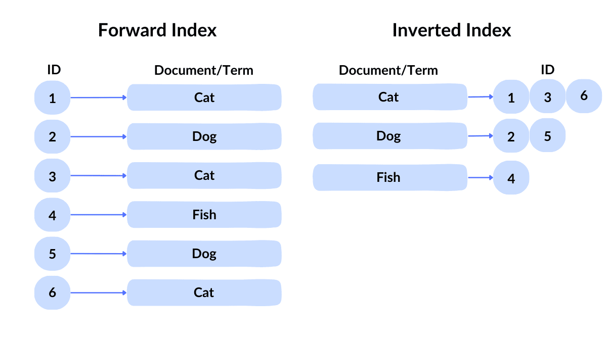

# Vector Similarity Search - IVF

Author: jay@thoughtmachina.com

Now that we’ve introduced our clustering algorithm, we can jump into how we can use it to build our first index type. Now that we’ve tamed k-means and watched it neatly arrange points into clusters, it’s time to put that structure to work. Remember the brutal truth from our brute-force experiments? Touching every vector for every query is painfully slow. We need a shortcut.

Enter **IVF — Inverted File (or Index) clustering**. The idea is simple: instead of searching through the entire dataset, we first ask *“which clusters look promising?”* and then only search inside those. Each centroid becomes a kind of signpost pointing to a small neighborhood of vectors. Yes, building the clusters is a bit of upfront work, but once they exist, queries don’t need to wander aimlessly anymore.

Think of it like this: before, your search was a blindfolded person poking around a haystack for needles. With IVF, you hand them a metal detector and a map of the haystack. They still might have to sift a little, but they’ll find the needles orders of magnitude faster. We’ll soon see how to take our k-means centroids, assign each vector to a cluster, and then perform **cluster-aware top-k search**. The result is a first taste of scalable vector search — the kind that actually *feels instant* even as your dataset grows.

## Inverted Indexes

Before we dive back into vectors, let’s take a detour into something older than k-means but just as magical: the **inverted index**. You’ve seen this under the hood of every search engine you’ve used. Google, Elasticsearch, SingleStore Full-Text Search (what I’ve worked on!) — they all rely on this humble structure to avoid scanning everything.

At its core, an inverted index is just a mapping from **tokens → locations**. In text search, the token is a word, and the locations are the documents containing it. Want to find all documents with `“vector”`? Don’t read every document — just look up `“vector”` in the index, grab the list of document IDs, and you’re done. Instant gratification, zero wasted cycles.

Why “inverted”? Because instead of storing documents → words (forward), we flip it: word → documents. Suddenly, queries that used to touch the entire dataset only touch relevant slices. This is the same philosophy we’ll carry into vector search: precompute relationships during ingest so queries can skip the irrelevant bulk.

### Dictionary and Posting Lists

If you look at the right-hand side of the diagram, you see an **inverted index** in action. It’s really two components: a **dictionary** and **posting lists**.



The **dictionary** is the simple part: it’s a list of all the unique terms in your dataset. In the image, that’s `Cat`, `Dog`, and `Fish`. Think of it as the “table of contents” — each word gets a single entry. No duplicates, no fluff.

The **posting lists** are where the magic happens. Each dictionary entry points to a list of **document IDs** where that term appears. For `Cat`, the posting list is `[1, 3, 6]`, meaning documents 1, 3, and 6 all contain the word `“Cat”`. These lists are the reason inverted indexes are fast: a query for `“Cat”` doesn’t scan every document — it jumps straight to the relevant IDs and ignores the rest.

Together, dictionary + posting lists form a lightning-fast lookup structure. Dictionary gives you the word, posting lists give you the locations. Later, when we talk IVF for vectors, you’ll see the same pattern: the **centroids are the dictionary**, and the **vectors assigned to them are the posting lists**. Queries first hit the dictionary, pick promising clusters, then scan only a small subset of vectors. Efficiency achieved, CPU spared.

## From Words to Vectors

So, how do we translate this wisdom from words to vectors? In the world of IVF, each **cluster centroid** acts like a dictionary entry, and the **vectors assigned to that centroid** are the posting list. Instead of “which documents contain the word `Cat`?”, the question becomes “which vectors live near this centroid?”

When a query comes in, we don’t touch the entire dataset. Instead, we first ask: *which centroids are closest to the query vector?* These are our promising neighborhoods. Then, we only search inside those clusters to find the true top-k nearest neighbors. The rest of the vectors? Ignored. CPU cycles saved, queries sped up, and you still get the correct nearest neighbors (or very close, depending on how many clusters you probe).

This is where **probe count** comes in. You can think of it as the number of neighborhoods you check. More probes = more accuracy, fewer probes = faster search. There’s a sweet spot where you get the majority of accuracy for a fraction of the cost. In practice, a handful of probes often gives near-perfect results, especially if your clusters are reasonably tight.

## Why IVF Works

The brilliance of IVF isn’t in new math—it’s in **structure and locality**. By clustering vectors and organizing them with inverted indexes, we exploit the natural “nearness” of data:

- **Cache efficiency:** All vectors assigned to a cluster are stored together, so scanning them hits memory in predictable bursts.
- **Fewer distance computations:** Instead of comparing a query to every vector, you only compare to a small fraction.
- **Parallelism-ready:** Each cluster can be searched independently, perfect for multi-threaded or distributed setups.

Think of it like dividing a library by genre. Instead of searching every shelf for a mystery novel, you walk straight to the mystery section. Your search is orders of magnitude faster because you leveraged **structure**.

## Next Up: Implementing IVF Flat

Now that we’ve convinced ourselves that brute force is too slow, it’s time to meet our first real index: **`ivf_flat`**. Think of it as the combination of **k-means clustering + inverted index magic**.

Here’s the high-level idea:

1. **Cluster the dataset:** Run k-means to find `m_centers`. Each center represents a neighborhood of vectors.
2. **Assign vectors to clusters:** Every vector remembers which centroid it belongs to. This is like tagging every house in a city with its postal code — makes finding them later way faster.
3. **Search efficiently:** When a query comes in, we don’t look everywhere. Instead:
    - Find the closest centroids (top `probe_count`).
    - Scan only the vectors in those clusters.
    - Keep track of the top-k results in a max-heap.

The `ivf_flat` class is basically a **shorthand for this entire workflow**.

Here’s the full class:

```cpp
template <int size> class ivf_flat {
public:
    struct result {
        int index;
        float distance;
    };

    // ------------------------------------------------------------
    // Public API
    // ------------------------------------------------------------
    void add(embedding<size> vector);
    void build();
    std::vector<result> top_k(embedding<size>& vector, int k);

private:
    // ------------------------------------------------------------
    // Internal helpers
    // ------------------------------------------------------------
    struct _result_compare {
        bool operator()(const result& l, const result& r) {
            return l.distance < r.distance;
        }
    };

    using result_pq = std::priority_queue<result, std::vector<result>, _result_compare>;
    using results = std::vector<result>;

    using index_and_embedding = std::pair<int, embedding<size>>;
    using index_and_embeddings = std::vector<index_and_embedding>;

    // Single-cluster top-k
    void top_k_internal(const embedding<size>& vector, int k,
                        const index_and_embeddings& data,
                        result_pq& top_closest);

    // Full dataset top-k (used for centroid search)
    results top_k_internal(embedding<size>& vector, int k,
                           std::vector<embedding<size>>& data,
                           result_pq& top_closest);

private:
    std::vector<embedding<size>> m_data;
    std::vector<embedding<size>> m_centers;
    std::unordered_map<int, index_and_embeddings> _index;
};
```

---

### **Add vectors**

```cpp
template <int size>
void ivf_flat<size>::add(embedding<size> vector) {
    // Push the vector into our dataset. 
    // Nothing fancy yet — just storing for later clustering.
    m_data.push_back(std::move(vector));
}
```

Simple, honest, and brutal — just like our `no_index`. All the cleverness comes **after we build the clusters**.

---

### **Building the index**

```cpp
template <int size>
void ivf_flat<size>::build() {
    const int center_count = 50;

    // Create a k-means instance and feed all vectors
    k_means<size> kmeans(center_count);
    for (auto& v : m_data)
        kmeans.add(v);

    // Train clusters and get assignments
    std::vector<int> assignments = kmeans.train(1000);
    m_centers = kmeans.get_centers();

    // Initialize inverted lists for each centroid
    for (int i = 0; i < center_count; i++)
        _index.emplace(i, index_and_embeddings());

    // Assign vectors to clusters
    for (int i = 0; i < m_data.size(); i++)
        _index[assignments[i]].push_back({i, m_data[i]});
}
```

This is the **setup magic**:

- Clusters are created with k-means.
- `_index` stores each vector under its centroid.
- Queries later **don’t have to touch vectors outside the top clusters**.

Metaphor: each centroid is a “street sign,” and the vectors are houses. You only visit streets likely to contain your target.

---

### **Single-cluster top-k search**

```cpp
template <int size>
void ivf_flat<size>::top_k_internal(const embedding<size>& vector, int k,
                                    const index_and_embeddings& data,
                                    result_pq& top_closest) {
    float worst_distance = top_closest.empty() ? 
        std::numeric_limits<float>::max() : top_closest.top().distance;
    int top_size = top_closest.size();

    for (auto& idx_and_vec : data) {
        float dist = vector.distance(idx_and_vec.second);

        if (top_size < k) {
            top_closest.push({idx_and_vec.first, dist});
            top_size = top_closest.size();
            if (top_size == k)
                worst_distance = top_closest.top().distance;
        } else if (dist < worst_distance) {
            top_closest.pop();
            top_closest.push({idx_and_vec.first, dist});
            worst_distance = top_closest.top().distance;
        }
    }
}
```

- Maintains a **max-heap** of top-k vectors in this cluster.
- Only pushes into the heap if a vector is better than the current worst.
- Efficient: minimal heap churn and fast distance computation.

Think: only add diamonds to your chest if they beat the worst one already in there.

---

### **Full top-k search for centroids**

```cpp
template <int size>
typename ivf_flat<size>::results
ivf_flat<size>::top_k_internal(embedding<size>& vector, int k,
                               std::vector<embedding<size>>& data,
                               result_pq& top_closest) {
    for (int i = 0; i < data.size(); i++) {
        float dist = vector.distance(data[i]);
        top_closest.push({i, dist});
        if (top_closest.size() > k) top_closest.pop();
    }

    results res;
    res.reserve(top_closest.size());
    while (!top_closest.empty()) {
        res.push_back(top_closest.top());
        top_closest.pop();
    }
    std::reverse(res.begin(), res.end());
    return res;
}
```

Used when searching **centroids themselves**, e.g., “which clusters should we probe?” — still heap-based, still correct, still brutally honest.

---

### **Querying: probing clusters**

```cpp
template <int size>
std::vector<typename ivf_flat<size>::result>
ivf_flat<size>::top_k(embedding<size>& vector, int k) {
    // 1. Find closest centroids
    result_pq top_centers_heap;
    results top_centers = top_k_internal(vector, m_centers.size(), m_centers, top_centers_heap);

    // 2. Probe only the top few clusters
    int probe_count = 3;
    result_pq top_closest;
    for (int i = 0; i < probe_count; i++) {
        auto& cluster_data = _index[top_centers[i].index];
        top_k_internal(vector, k, cluster_data, top_closest);
    }

    // 3. Flatten heap to results vector
    results res;
    res.reserve(top_closest.size());
    while (!top_closest.empty()) {
        res.push_back(top_closest.top());
        top_closest.pop();
    }
    std::reverse(res.begin(), res.end());
    return res;
}
```

- Finds promising centroids first.
- Scans only a handful of clusters (`probe_count`).
- Merges top-k results across clusters using a heap.

Metaphor: the shopper now only checks the most likely aisles — the treasure hunt is focused, efficient, and fast.

---

This setup mirrors **inverted indexes for text**, but for high-dimensional vectors. The centroids are the dictionary, vectors are posting lists, and the query is smart enough to avoid wasting time on irrelevant entries.

The complete class for reference:

```cpp

template <int size> class ivf_flat {
    struct _result_compare {
        bool operator()(const result& l, const result& r) {
            return l.distance < r.distance;
        }
    };

    using result_pq = std::priority_queue<result, results, _result_compare>;
    using index_and_embedding = std::pair<int, embedding<size>>;

    // store both of this together for better cache hit performance
    // (as opposed to having a map from centers -> indexes of points assigned to
    // center, we have a map from centers -> indexes and embeddings)
    using index_and_embeddings = std::vector<index_and_embedding>;

    results top_k_internal(embedding<size>& vector, int k,
                           std::vector<embedding<size>>& data,
                           result_pq& top_closest) {

        int data_size = data.size();
        for (int i = 0; i < data_size; i++) {
            result distance{i, vector.distance(data[i])};

            top_closest.push(distance);
            if (top_closest.size() > k) {
                top_closest.pop();
            }
        }

        results res;
        res.reserve(top_closest.size());

        while (!top_closest.empty()) {
            res.push_back(top_closest.top());
            top_closest.pop();
        }

        std::reverse(res.begin(), res.end());
        return res;
    }

    void top_k_internal(const embedding<size>& vector, int k,
                        const index_and_embeddings& data,
                        result_pq& top_closest) {

        const index_and_embedding* __restrict__ data_ptr = data.data();
        const embedding<size>* __restrict__ db = m_data.data();

        float worst_distance = top_closest.empty()
                                   ? std::numeric_limits<float>::max()
                                   : top_closest.top().distance;

        int top_closest_size = top_closest.size();
        int data_size = data.size();

        for (int i = 0; i < data_size; ++i) {
            index_and_embedding idx_and_vector = data_ptr[i];
            float dist = vector.distance(idx_and_vector.second);

            if (top_closest_size < k) {
                top_closest.push({idx_and_vector.first, dist});
                top_closest_size = top_closest.size();

                if (top_closest_size == k)
                    worst_distance = top_closest.top().distance;

            } else if (dist < worst_distance) {
                top_closest.pop();
                top_closest.push({idx_and_vector.first, dist});
                worst_distance = top_closest.top().distance;
            }
        }
    }

public:
    void add(embedding<size> vector) { m_data.push_back(vector); }

    results top_k(embedding<size>& vector, int k) {
        result_pq top_closest_centers;
        results top_centers = top_k_internal(vector, m_centers.size(),
                                             m_centers, top_closest_centers);

        int probe_count = 3;
        result_pq top_closest;

        for (int i = 0; i < probe_count; i++) {
            result& center = top_centers[i];
            auto& data = _index[center.index];
            top_k_internal(vector, k, data, top_closest);
        }

        results res;
        res.reserve(top_closest.size());

        while (!top_closest.empty()) {
            res.push_back(top_closest.top());
            top_closest.pop();
        }

        std::reverse(res.begin(), res.end());
        return res;
    }

    void build() {
        const int center_count = 50;
        k_means<size> kmeans(center_count);
        for (int i = 0; i < m_data.size(); i++) {
            kmeans.add(m_data[i]);
        }

        std::vector<int> assignments = kmeans.train(1000);
        m_centers = kmeans.get_centers();

        for (int i = 0; i < center_count; i++) {
            _index.emplace(i, index_and_embeddings());
        }

        for (int i = 0; i < m_data.size(); i++) {
            _index[assignments[i]].push_back({i, m_data[i]});
        }
    }

private:
    std::vector<embedding<size>> m_data;
    std::vector<embedding<size>> m_centers;
    std::unordered_map<int, index_and_embeddings> _index;
};
```

# Are promises kept?

Now it’s time to see if our shiny new `ivf_flat` index lives up to the hype. We already know brute-force works, but painfully so; here we want to witness the promised order-of-magnitude speedup. This little runner generates clustered vectors, fires off queries, and then measures exactly how much time our clever cluster-aware strategy saves. If `ivf_flat` is doing its job, the timer will reward it with tiny numbers, and the CPU will finally get a break.

```cpp
int main() {
    const int width = 256;
    const int data_points = 160000;
    const int search_count = 1000;
    const bool print = false;

    std::vector<embedding<width>> vectors;
    std::vector<embedding<width>> search_vectors;

    {
        // ------------------------------------------------------------
        // Create dataset: K Gaussian clusters in 256-D
        // ------------------------------------------------------------
        std::random_device rd;
        std::mt19937 gen(rd());

        const int true_k = 20; // real underlying clusters
        std::normal_distribution<float> center_noise(0.0f, 1.0f);
        std::normal_distribution<float> point_noise(0.0f,
                                                    0.10f); // cluster spread

        // Generate true cluster centers
        std::vector<std::vector<float>> centers;
        centers.reserve(true_k);

        for (int c = 0; c < true_k; c++) {
            std::vector<float> ctr(width);
            for (int d = 0; d < width; d++) {
                ctr[d] = center_noise(gen) * 0.5f; // spread centers apart
            }
            centers.push_back(std::move(ctr));
        }

        // Generate data points by sampling around these centers
        std::uniform_int_distribution<int> pick_cluster(0, true_k - 1);

        for (int i = 0; i < data_points; i++) {
            int cid = pick_cluster(gen);
            const auto& ctr = centers[cid];

            std::vector<float> vec(width);
            for (int d = 0; d < width; d++) {
                vec[d] = ctr[d] + point_noise(gen);
            }

            vectors.emplace_back(vec);
        }

        // ------------------------------------------------------------
        // Generate search vectors: sampled from real clusters
        // ------------------------------------------------------------

        for (int i = 0; i < search_count; i++) {
            int cid = pick_cluster(gen);
            const auto& ctr = centers[cid];

            std::vector<float> vec(width);
            for (int d = 0; d < width; d++) {
                vec[d] =
                    ctr[d] + point_noise(gen); // sampling near cluster center
            }

            search_vectors.emplace_back(vec);
        }
    }

    timer timer;
    uint64_t elapsed;

    {
        std::cout << "Starting to build an (no-)index:\n";
        timer.start();
        no_index<width> wild_world;
        for (const auto& vec : vectors) {
            wild_world.add(vec);
        }
        uint64_t elapsed = timer.elapsed();
        std::cout << "Index built in " << elapsed << " micro secs\n";
        timer.start();
        for (int i = 0; i < search_vectors.size(); i++) {
            results results = wild_world.top_k(search_vectors[i], 10);
            if (print) {
                std::cout << "Results[" << i << "]\n";
                print_results(results);
            }
        }
        elapsed = timer.elapsed();
        std::cout << "Search in " << elapsed << " micro secs\n";
    }

    {
        std::cout << "Starting to build an ivf_flat index:\n";
        timer.start();
        ivf_flat<width> ivfflat;
        for (const auto& vec : vectors) {
            ivfflat.add(vec);
        }
        ivfflat.build();
        elapsed = timer.elapsed();
        std::cout << "Index built in " << elapsed << " micro secs\n";

        timer.start();
        for (int i = 0; i < search_vectors.size(); i++) {

            results results = ivfflat.top_k(search_vectors[i], 10);
            if (print) {
                std::cout << "Results[" << i << "]\n";
                print_results(results);
            }
        }
        elapsed = timer.elapsed();

        std::cout << "Search in " << elapsed << " micro secs\n";
    }

    return 0;
}
```

```cpp
jay@jayport:~/code/vector $ clang++ --std=c++20 indexes/ivf_flat.cpp -o3 -framework Accelerate -g -framework Accelerate -o x 
jay@jayport:~/code/vector $ ./x
Starting to build an (no-)index:
Index built in 62664 micro secs
Search in 3562531 micro secs
Starting to build an ivf_flat index:
Index built in 35436212 micro secs
Search in 380581 micro secs
```

And there it is—the payoff. Building `ivf_flat` takes real work this time, because k-means isn’t free and structure doesn’t appear out of thin air. But once that cost is paid, the queries suddenly feel lighter, faster, and far less desperate. Brute force still does what it always does: cheap setup, then a full scan for every question, grinding through millions of distance computations. IVF Flat flips that equation. We spend time organizing the space up front, and in return each query only visits a few well-chosen neighborhoods. The result is exactly what we promised ourselves at the start: ***an honest-to-goodness order-of-magnitude speedup at query time***. 

**The timer doesn’t care about our intentions or elegance—it just reports the truth. And the truth is that structure wins.**

## Accuracy Still Matters (a.k.a. Did We Break Anything?)

Speed is great. Speed *with wrong answers* is not.

Up to now, brute force had a comforting property: it was slow, but it was always right. IVF Flat, on the other hand, is an **ANN** index. By probing only a few clusters, we’re explicitly choosing not to look everywhere. That’s the deal we make for speed. Which means we now owe ourselves a second measurement: **recall**.

Recall answers a simple, uncomfortable question: *how often does our fast index agree with the ground truth?* If the brute-force top-k is the gold standard, recall@k tells us how many of those true neighbors we managed to recover with IVF. A recall of 1.0 means we’re perfect. Anything less means we missed something—but maybe not enough to care.

So before declaring victory, we add a small honesty check. For each query, we compare IVF’s results against brute force and count overlaps. No hand-waving, no vibes—just numbers.

```cpp
    {
        std::cout << "Measuring recall...\n";

        std::vector<int> ks = {5, 10, 20, 50, 100, 200, 500, 1000};
        std::unordered_map<int, int> correct;

        for (int k : ks) {
            correct[k] = 0;
        }

        for (int i = 0; i < search_vectors.size(); i++) {
            auto gt = wild_world.top_k(search_vectors[i], 1000);
            auto approx = ivfflat.top_k(search_vectors[i], 1000);

            std::unordered_map<int, std::unordered_set<int>> gt_sets;
            for (int k : ks) {
                for (int j = 0; j < k; j++) {
                    gt_sets[k].insert(gt[j].index);
                }
            }

            for (int k : ks) {
                for (int j = 0; j < k; j++) {
                    if (gt_sets[k].count(approx[j].index)) {
                        correct[k]++;
                    }
                }
            }
        }

        for (int k : ks) {
            float recall = float(correct[k]) / float(search_vectors.size() * k);
            std::cout << "Recall@" << k << " = " << recall << std::endl;
        }
    }
```

```cpp
jay@jayport:~/code/vector $ ./x
Starting to build an (no-)index:
Index built in 47297 micro secs
Search in 3487182 micro secs
Starting to build an ivf_flat index:
Index built in 26028571 micro secs
Search in 403344 micro secs
Measuring recall...
Recall@5 = 0.9648
Recall@10 = 0.9632
Recall@20 = 0.9615
Recall@50 = 0.96004
Recall@100 = 0.95865
Recall@200 = 0.957855
Recall@500 = 0.956254
Recall@1000 = 0.955114
```

These numbers tell a very comforting story. IVF Flat isn’t just fast — it’s *confident*. Even at `Recall@5`, we’re already north of 96%, and the curve barely drifts as `k` grows. That slow, graceful decline is exactly what you want to see: the index is consistently finding the right neighborhood, and the few misses aren’t catastrophic outliers but marginal swaps deep in the tail. In other words, IVF isn’t “guessing and getting lucky” — it’s systematically narrowing the search space and doing it well.

What makes this especially satisfying is the trade we’re making. We paid ~26 seconds once to build structure, and in return ***we cut query latency by almost an order of magnitude while giving up only a few percentage points of recall — and even those are mostly in the long tail***. For practical systems, this is the sweet spot: fast enough to feel instant, accurate enough that reranking can clean up whatever remains. This is the moment where approximate nearest neighbor search stops being theoretical and starts looking very deployable.

---

---

Up to this point, all our wins have come from *looking at fewer vectors*. IVF decides *where* to search, SIMD makes distance cheaper, and smarter heaps avoid wasted work. But there’s a deeper, more stubborn cost we haven’t touched yet: **what a vector actually is in memory**. A 256-D embedding isn’t just math — it’s 256 floats, cache lines, memory bandwidth, and loads that add up fast once you start scaling. (prod models have even larger dimensions - 512, 768, 1024, onwards, upwards, into scary larger worlds)

Even with IVF, once we enter a cluster we’re still doing full-precision distance calculations against every vector inside it. That means pulling large chunks of memory into cache, over and over, just to throw most of it away. At small scales this is fine. At millions or billions of vectors, it’s the real bottleneck. The CPU can compute faster than it can be fed.

This is where the next idea comes from: **approximate the vectors themselves**, not just the search path. If we can replace a 256-float vector with tiny codes that still preserves relative distances well enough, we cut memory traffic, improve cache locality, and unlock hopefully another order-of-magnitude speedup. The math gets more interesting, the errors become intentional, and recall becomes something we measure instead of assume. That’s the trade we’re about to make.